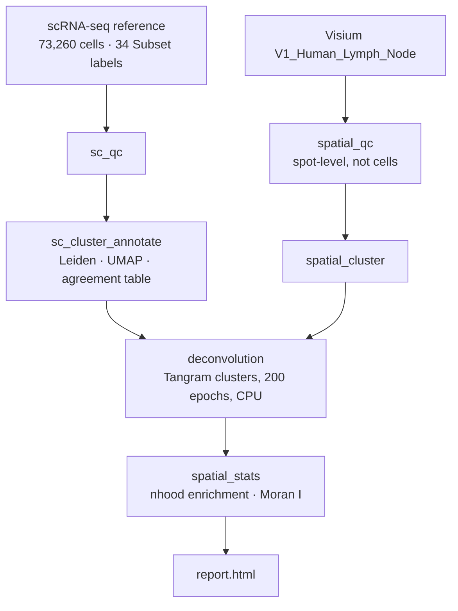

# Spatial Immune Atlas Pipeline

[](https://github.com/christopher2026/Spatial-Immunology-Atlas-Pipeline/actions/workflows/ci.yml)
[](https://www.nextflow.io/)
[](https://github.com/christopher2026?tab=packages)
[](LICENSE)

A Nextflow DSL2 pipeline that maps a curated scRNA-seq immune atlas onto 10x Visium human lymph node,
then summarises spatial structure with neighbourhood enrichment and Moran’s I. Each step runs in a
digest-pinned Docker image. GitHub Actions executes the full DAG on a committed subsample.

It does **not** run ligand–receptor analysis. Production Tangram used **cluster** mode (200 epochs, CPU),
not a fully trained cell-level map.

---

## Key result

On `V1_Human_Lymph_Node`, Tangram put germinal-centre B cells and follicular dendritic cells in
follicle-shaped regions and CD4 / cytotoxic CD8 T cells in the surrounding paracortex. Moran’s I on
HVGs ranked `IGHG1`, `CCL21`, `FDCSP`, and `IGHG2` — IgG and FDC programmes versus the T-zone chemokine
`CCL21`. That is the same B-in / T-around contrast as the cell-type maps, and it matches the anatomy
expected for this tissue (and, in broad terms, cell2location Fig. 4 on the same sample).

Full narrative, caveats, and validation checks: [`docs/results.md`](docs/results.md). After a production
run, the standalone story is `results/report.html`. To embed a figure here, copy one Tangram spatial
PNG (for example `FDC` or `B_GC_LZ`) into `docs/figures/` and link it below this paragraph.

---

## Pipeline



## Quickstart

Needs Linux or WSL2, Nextflow ≥ 24.10, and Docker. First-time WSL notes: [`setup/WSL_SETUP.md`](setup/WSL_SETUP.md).

**Verify a clone** (no `fetch_data`, uses `assets/test_data/`):

```bash
nextflow run main.nf -profile test,docker
test -s results/report.html
```

This is what CI runs. It is a DAG smoke test (loose QC, Tangram 20 epochs), not the production biology.

**Production run** (real atlas + Visium; do not change Tangram flags if you only want to rerun later steps):

```bash
python bin/fetch_data.py --all --inspect
nextflow run main.nf -profile docker -resume \
  --sc_run_scrublet false \
  --tangram_mode clusters --tangram_num_epochs 200 --tangram_device cpu \
  --nhood_n_perms 1000 --moran_n_perms 100
```

Images are `ghcr.io/christopher2026/stpipe-{scanpy,tangram,report}:0.1.0` pinned by digest in
`nextflow.config`. Optional process test: `nf-test test tests/modules/local/sc_qc/main.nf.test`.

## Data

| Dataset | Source | Scale |
|---|---|---|
| Visium | 10x `V1_Human_Lymph_Node` | 4,035 spots (4,025 after QC), H&E |
| scRNA-seq | Kleshchevnikov et al., *Nat Biotechnol* 2022 | 73,260 cells, 34 `Subset` types |

[`bin/fetch_data.py`](bin/fetch_data.py) downloads both. The pairing is the cell2location / Tangram tutorial
pair, so the spatial map can be checked against a published figure.

## Why lymph node

Follicles (B / GC / FDC) and paracortex (T) are known ground truth. A pretty map that puts B cells in
the T zone is a failed deconvolution.

## Tech stack

Nextflow DSL2 · Docker / GHCR · scanpy 1.11.5 · squidpy 1.8.2 · tangram-sc 1.0.4 · PyTorch 2.13 CPU ·
Jinja2 · GitHub Actions. Three images, not one: QC/stats, Tangram, report.

## Repository layout

```
main.nf                 entry workflow
nextflow.config         params + profiles (standard, docker, test, debug)
conf/                   resources, docker containers, test profile
modules/local/          one DSL2 process per step
subworkflows/local/     PREPROCESS (sc + spatial)
bin/                    argparse CLIs (runnable without Nextflow)
docker/                 pinned image definitions
assets/test_data/       ~500 stratified cells, ~200 contiguous spots (CI)
docs/                   methods, results, learning log
.github/workflows/ci.yml
tests/                  nf-test (SC_QC unit test; not required for CI)
```

## Documentation

- [`docs/methods.md`](docs/methods.md) — parameters and tools
- [`docs/results.md`](docs/results.md) — biological interpretation
- [`docs/learning-log.md`](docs/learning-log.md) — bugs and decisions
- [`PROJECT_PLAN.md`](PROJECT_PLAN.md) — phase tracker
- [`PROJECT_HANDOFF.md`](PROJECT_HANDOFF.md) — original brief

## License

MIT
