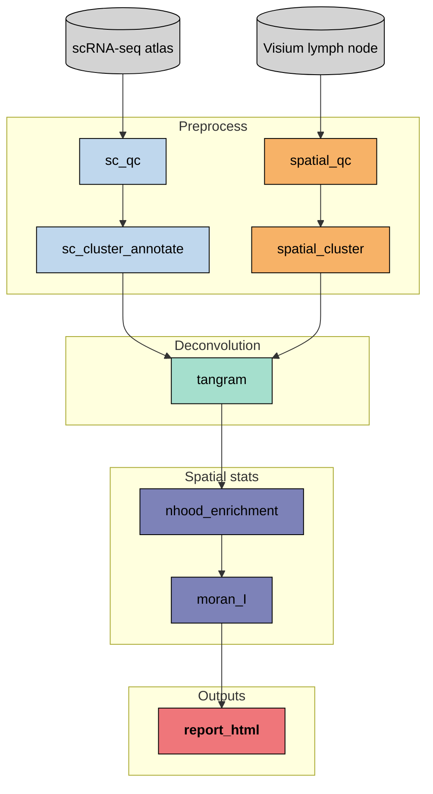

# Spatial Immune Atlas Pipeline

[](https://github.com/christopher2026/Spatial-Immunology-Atlas-Pipeline/actions/workflows/ci.yml)
[](https://www.nextflow.io/)
[](LICENSE)

A reproducible Nextflow pipeline that maps a curated scRNA-seq immune atlas onto 10x Visium human lymph node, then quantifies spatial structure with neighbourhood enrichment and Moran I.

---

## Background

Human lymph node has textbook compartments: B-cell follicles / germinal centres, T-cell paracortex, and medulla. That layout is ground truth. If deconvolution is right, B-lineage programmes land in follicles and T-lineage programmes in the paracortex. This repo runs that check end to end in Docker, with GitHub Actions on a committed subsample.

Production Tangram used cluster mode (200 epochs, CPU), not a fully trained cell-level map. Ligand-receptor analysis was not run.

---

## Biological questions

1. Do mapped germinal-centre B cells and follicular dendritic cells occupy follicle-shaped regions?
2. Do CD4 and cytotoxic CD8 T cells occupy the surrounding paracortex?
3. Which genes are spatially autocorrelated, and do they agree with that B-in / T-around pattern?

---

## Datasets

| Dataset | Type | Description |
|---|---|---|
| Kleshchevnikov et al., *Nat Biotechnol* 2022 | scRNA-seq | Integrated lymph node / spleen / tonsil atlas: 73,260 cells, 34 `Subset` labels |
| 10x `V1_Human_Lymph_Node` | Visium | 4,035 spots (4,025 after QC), paired H&E |

Both are public and downloaded by [`bin/fetch_data.py`](bin/fetch_data.py). The pairing is the cell2location / Tangram tutorial pair, so maps can be checked against a published figure.

---

## Pipeline

Nextflow DSL2. Each step is a module with a typed I/O contract; analysis logic lives in `bin/*.py`. Three digest-pinned GHCR images: scanpy/squidpy, Tangram, report.

```
stpipe/
|-- main.nf
|-- nextflow.config
|-- conf/                  base, docker, test profiles
|-- modules/local/         one process per step
|-- subworkflows/local/    PREPROCESS (sc + spatial)
|-- bin/                   argparse CLIs
|-- docker/                pinned images
|-- assets/test_data/      CI fixtures (~500 cells, ~200 spots)
|-- docs/                  methods, results, learning log
|-- tests/                 nf-test (SC_QC)
`-- .github/workflows/ci.yml
```

### DAG



### Steps

| Module | Tools | Role |
|---|---|---|
| `sc_qc` | scanpy | Recalculate QC; filter cells/genes; Scrublet off on the full atlas |
| `sc_cluster_annotate` | scanpy, leidenalg | Normalise, HVG, PCA, Leiden, UMAP; agreement vs `Subset` |
| `spatial_qc` | scanpy, squidpy | Spot-level QC (spots are mixtures, not cells) |
| `spatial_cluster` | scanpy, squidpy | Leiden on spots; overlay on H&E |
| `deconvolution` | tangram-sc, torch | Cluster-level mapping; per-spot type proportions |
| `spatial_stats` | squidpy | Spatial-graph nhood enrichment; Moran I on HVGs |
| `report` | jinja2, pandas | Standalone `results/report.html` |

---

## Key result

Tangram placed germinal-centre B cells and FDCs in follicle-shaped regions and CD4 / cytotoxic CD8 T cells in the paracortex. Moran I ranked `IGHG1`, `CCL21`, `FDCSP`, `IGHG2` (IgG / FDC programmes vs the T-zone chemokine `CCL21`). Narrative and caveats: [`docs/results.md`](docs/results.md). After a production run, open `results/report.html`.

---

## Setup

Linux or WSL2, Nextflow >= 24.10, Docker. WSL notes: [`setup/WSL_SETUP.md`](setup/WSL_SETUP.md).

```bash
git clone https://github.com/christopher2026/Spatial-Immunology-Atlas-Pipeline.git
cd Spatial-Immunology-Atlas-Pipeline

# CI smoke test (committed subsample; no data download)
nextflow run main.nf -profile test,docker
test -s results/report.html

# Production (real atlas + Visium)
python bin/fetch_data.py --all --inspect
nextflow run main.nf -profile docker -resume \
  --sc_run_scrublet false \
  --tangram_mode clusters --tangram_num_epochs 200 --tangram_device cpu \
  --nhood_n_perms 1000 --moran_n_perms 100
```

Containers: `ghcr.io/christopher2026/stpipe-{scanpy,tangram,report}:0.1.0`, pinned by digest in `nextflow.config`. Optional: `nf-test test tests/modules/local/sc_qc/main.nf.test`.

---

## Status

Core DAG is complete and green on GitHub Actions (`-profile test,docker`). Production biology is cluster-mode Tangram plus spatial stats. Stretch (cell2location, `ligrec`, multi-sample) is not in the executable pipeline.

---

## Documentation

| Doc | Contents |
|---|---|
| [`docs/methods.md`](docs/methods.md) | Tools, versions, parameters |
| [`docs/results.md`](docs/results.md) | Biological interpretation |
| [`docs/learning-log.md`](docs/learning-log.md) | Decisions and bugs |
| [`PROJECT_PLAN.md`](PROJECT_PLAN.md) | Phase tracker |

## License

MIT
