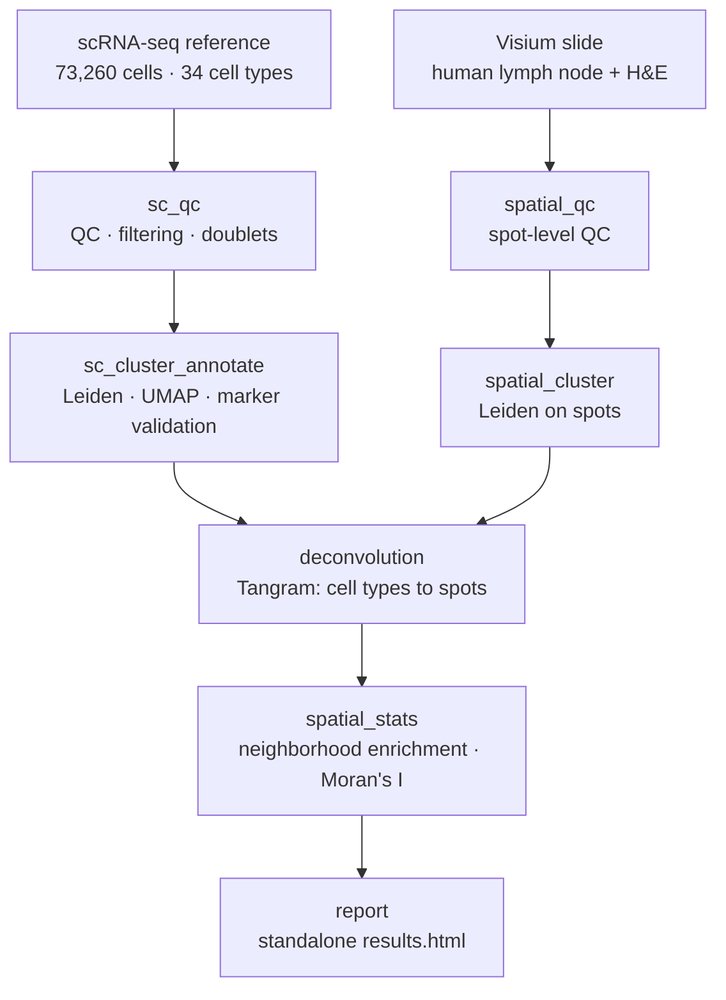

# Spatial Immune Atlas Pipeline

> A reproducible Nextflow pipeline that integrates single-cell RNA-seq and spatial transcriptomics
> data from human lymph node to spatially map immune cell types, identify tissue niches (T-cell zones,
> B-cell follicles, germinal centres), and characterise cell-cell communication — containerised
> end-to-end with Docker and tested in CI.

**Status: Phase 0 — scaffold complete, modules not yet implemented.**
Build progress and phase checklists: [`PROJECT_PLAN.md`](PROJECT_PLAN.md).

<!-- Phase 7: add CI badge, Nextflow badge, license badge, and the key results figure here. -->

---

## Pipeline



## Quickstart

Requires Linux or WSL2 with Docker. First-time setup: [`setup/WSL_SETUP.md`](setup/WSL_SETUP.md).

```bash
# Fast subsampled smoke test — the one command to verify the pipeline works
nextflow run main.nf -profile test,docker

# Full run on the real datasets
python bin/fetch_data.py --all --inspect
nextflow run main.nf -profile docker
```

## Data

| Dataset | Source | Scale |
|---|---|---|
| Visium spatial | 10x Genomics `V1_Human_Lymph_Node` | ~4,000 spots, paired H&E |
| scRNA-seq reference | Kleshchevnikov et al., *Nat Biotechnol* 2022 (cell2location) — integrated lymph node / spleen / tonsil atlas | 73,260 cells, 34 curated cell types |

Both are public and fetched by [`bin/fetch_data.py`](bin/fetch_data.py). This exact pairing is used in
the published cell2location and Tangram tutorials, which means the deconvolution result can be
validated against a peer-reviewed figure rather than only eyeballed for plausibility.

## Why human lymph node

The lymph node has textbook spatial organisation: B-cell follicles with germinal centres, surrounding
T-cell paracortex, and medullary/stromal regions. That known architecture acts as ground truth — if
the deconvolution is correct, B-cell types must land in follicles and T-cell types in the paracortex.
A pipeline you can falsify is worth more than one you can only admire.

## Tech stack

Nextflow DSL2 · Docker · scanpy · squidpy · Tangram (PyTorch) · scrublet · Jinja2 · GitHub Actions

## Repository layout

```
main.nf                 entry workflow
nextflow.config         params + profiles (standard, docker, test, debug)
conf/                   base resources, docker, test profile
modules/local/          one DSL2 process per analysis step
subworkflows/local/     preprocess (wires the sc + spatial branches)
bin/                    argparse CLI python scripts — every step runs standalone
docker/                 one image per tool, versions pinned
env/                    micromamba env for local script iteration
assets/                 report template + committed subsampled test data
docs/                   methods, results narrative, learning log
setup/                  WSL2 / Docker / Nextflow bootstrap
tests/                  nf-test
```

Analysis logic lives in `bin/*.py` as command-line tools rather than inline in Nextflow `script:`
blocks. That is the nf-core convention, and it means every step is debuggable and testable outside
Nextflow — which matters far more in practice than it sounds.

## Documentation

- [`PROJECT_PLAN.md`](PROJECT_PLAN.md) — phased build plan and progress tracker
- [`PROJECT_HANDOFF.md`](PROJECT_HANDOFF.md) — original scope and design brief
- [`docs/methods.md`](docs/methods.md) — paper-style methods with versions and parameters
- [`docs/results.md`](docs/results.md) — biological interpretation of the spatial map
- [`docs/learning-log.md`](docs/learning-log.md) — decisions and debugging notes

## License

MIT
